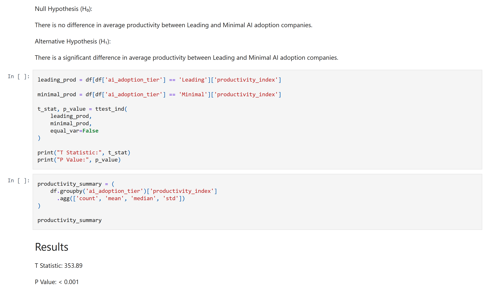
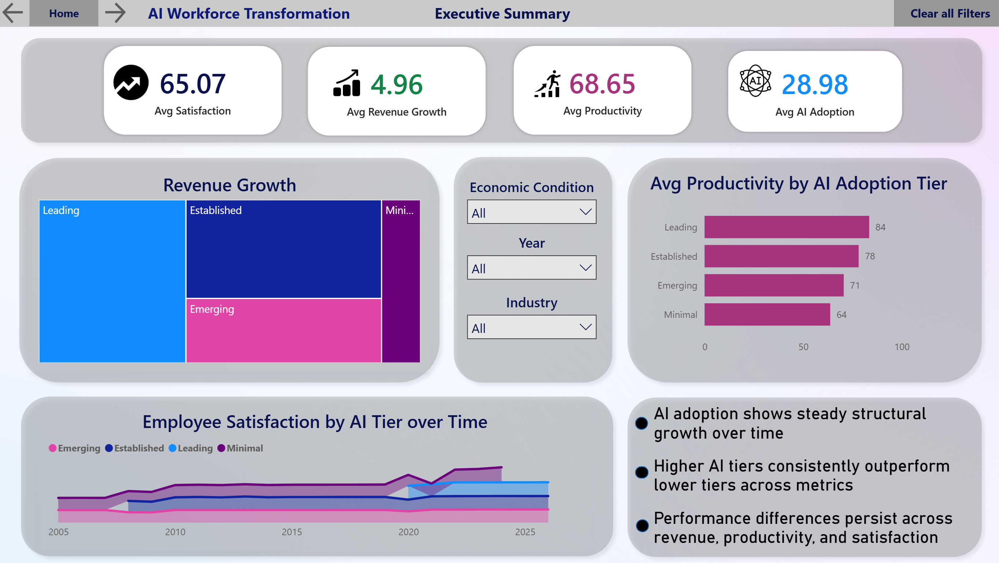
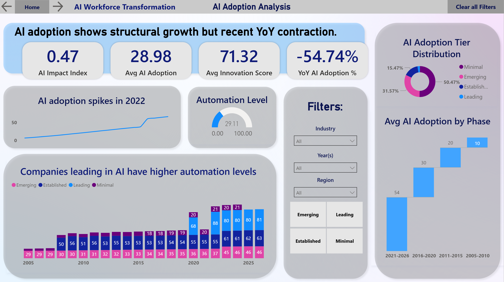
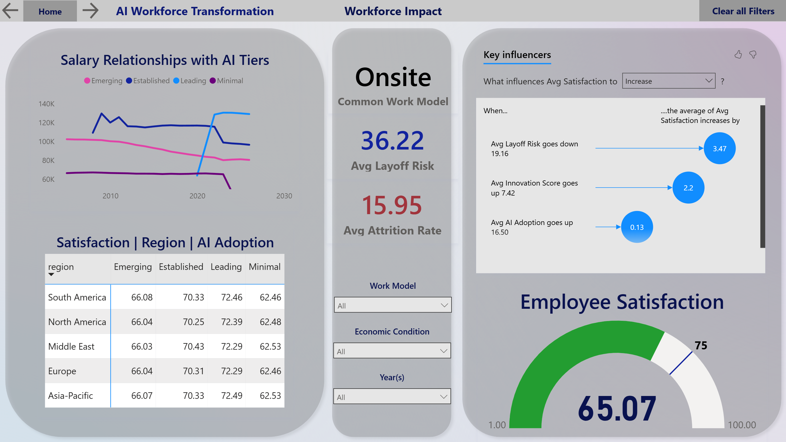
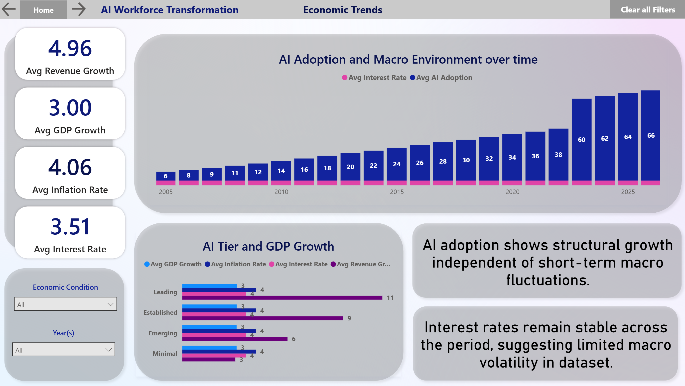

# AI Workforce Transformation Analysis

This project explores how AI adoption and automation relate to business performance and workforce outcomes using a 1M-row simulated workforce dataset.

I started this project to:

1. To build a realistic end-to-end analytics project beyond tutorial-style dashboards.
2. To strengthen SQL (PostgreSQL), Python, and analytics skills while transitioning from IT leadership into data analytics.

Rather than focusing only on visualization, I wanted to work through the full analytics workflow: data inspection, cleaning, feature engineering, database loading, SQL analysis, and reporting.

<p align='center'>
	
</p>

<p align='center'>
  
  
  
  
</p>

## Business Question

Many organizations are investing heavily in AI and automation, but it is still unclear whether these investments consistently translate into measurable business outcomes.

This project explores questions such as:

* Do companies with higher AI adoption experience stronger revenue growth?
* Does automation improve productivity?
* How does automation affect employee satisfaction?
* Which industries appear to benefit most from AI adoption?
* Is higher automation associated with increased or decreased layoffs?

## Dataset

Source:
https://www.kaggle.com/datasets/aiexplorer77/ai-hiring-layoffs-and-workforce-analytics

The dataset contains 1,000,000 simulated company records across multiple industries, departments, and regions.

## Tools Used

* Python
* Pandas
* PostgreSQL
* SQLAlchemy
* DBeaver
* Git / GitHub
* Power BI (in progress)

## Project Workflow

### 1. Data Inspection

Performed initial data quality assessment, reviewed distributions, validated data types, and identified missing values.

### 2. Data Cleaning

* Removed data quality issues
* Filled missing values using industry-level median imputation
* Validated results after cleaning
```python
df['avg_salary'] = df.groupby('industry')['avg_salary'].transform(lambda x: x.fillna(x.median()))

df['revenue_growth'] = df.groupby('industry')['revenue_growth'].transform(lambda x: x.fillna(x.median()))

df['employee_satisfaction'] = df.groupby('industry')['employee_satisfaction'].transform(lambda x: x.fillna(x.median()))
```
### 3. Feature Engineering

Created additional business-focused fields:

* AI Adoption Tier
* Automation Tier

These categories allow comparisons between organizations with different levels of AI maturity.
```python
df['ai_adoption_tier'] = pd.cut(
    df['ai_adoption_score'],
    bins=[0, 25, 50, 75, 100],
    labels=[
        'Minimal',
        'Emerging',
        'Established',
        'Leading'
    ],
    include_lowest=True
)

df['automation_tier'] = pd.cut(
    df['automation_level'],
    bins=[0, 25, 50, 75, 100],
    labels=[
        'Very Low', 
        'Low',
        'Medium',
        'High'
    ],
    include_lowest=True
)
```

### 4. Database Loading

Loaded the cleaned dataset into PostgreSQL using SQLAlchemy and verified successful ingestion of all 1,000,000 records.

### 5. SQL Analysis

Used PostgreSQL to investigate relationships between AI adoption, automation, and business performance.

Early findings suggest:

* Higher AI adoption is consistently associated with higher average revenue growth.
* Productivity increases steadily with AI adoption level across industries.
* Automation shows a mild positive relationship with employee satisfaction, though the effect is weaker than revenue and productivity signals.
* AI adoption appears to improve productivity across all industries at a remarkably consistent rate.


```sql
select
	industry,
	round(
		avg(
			case
				when ai_adoption_tier = 'Leading'
				then productivity_index
			end
		)::numeric,2
	) as leading_productivity,
	round(
		avg(
			case
				when ai_adoption_tier = 'Minimal'
				then productivity_index
			end
		)::numeric,2
	) as minimal_productivity,
	round(
		avg(
			case
				when ai_adoption_tier = 'Leading'
				then productivity_index
			end
		)::numeric
		-
		avg(
			case
				when ai_adoption_tier = 'Minimal'
				then productivity_index
			end
		)::numeric
	,2) as productivity_gain
from ai_workforce_data awd
group by industry
order by productivity_gain desc;
```

## Statistical Analysis

To validate patterns identified during SQL analysis, statistical testing was performed using Python, Pandas, SciPy, and Scikit-learn.

The notebook includes:

- Correlation analysis between AI adoption, automation, productivity, revenue growth, and workforce metrics
- Hypothesis testing (t-tests) comparing Leading and Minimal AI adoption groups
- Productivity analysis across AI adoption tiers
- Linear regression modeling to evaluate the relationship between AI adoption and revenue growth

### Key Findings

- Revenue growth differences between Leading and Minimal AI adopters were statistically significant (**p < 0.001**)
- Productivity increased consistently across AI adoption tiers
- AI adoption showed a positive relationship with revenue growth
- Regression analysis found a statistically significant relationship, although AI adoption alone explained only a portion of overall revenue variation (**R² ≈ 0.046**)

The complete analysis can be found in:

`notebooks/02_statistical_analysis.ipynb`

## Repository Structure

notebooks/

* Data inspection, cleaning, statistical analysis, and ETL notebooks

sql/

* Business questions and analysis queries

dashboard/

* Power BI files 

reports/

* Final report and project documentation

images/

* Images used in dashboard and report

## Current Status

Completed:

* Data inspection
* Data cleaning
* Feature engineering
* PostgreSQL integration
* Initial business analysis
* Dashboard (Executive Summary, AI Adoption Analysis, Workforce Impact, Economic Trends)
* SQL workforce analysis

In Progress:

* Report
* Final case study


## About Me

I am transitioning from IT leadership and business systems into data analytics.

My background includes IT operations, reporting automation, business systems development, and stakeholder-facing analytics.

This project reflects that transition, focusing on SQL, statistical analysis, and end-to-end data storytelling rather than isolated dashboards.

